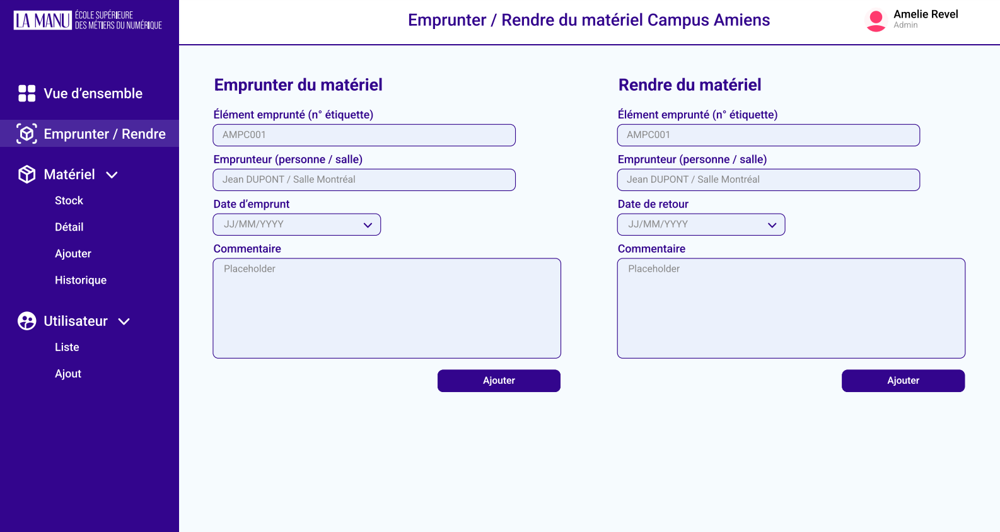
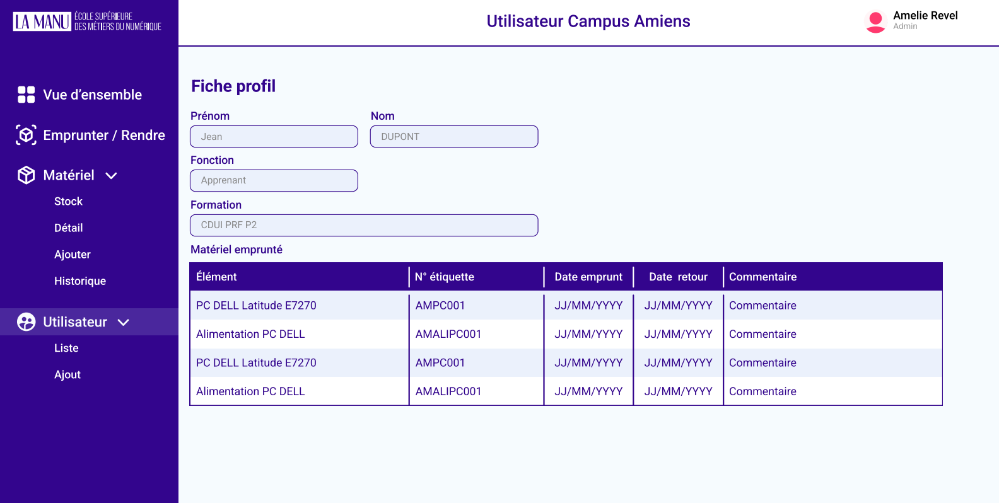

# Gestionnaire de Matériel

**Gestionnaire de Matériel** est une application métier conçue pour gérer le stock de matériel sur le campus d'Amiens de La Manu. Ce projet a pour but de simplifier la gestion du matériel, des emprunteurs, et des emprunts, tout en offrant une vue d'ensemble via un tableau de bord.

## 🖼️ Aperçu du Jeu

Voici un aperçu du site :

## 🎯 Contexte

La Manu a besoin d'un outil de gestion de stock pour le matériel présent sur ses campus. Ce projet est développé pour le campus d'Amiens et est destiné à différents types d'utilisateurs, dont les administrateurs, les enseignants, le personnel administratif, et le directeur du campus.

## 📜 Spécifications Fonctionnelles

### Gestion des Utilisateurs
- **Création de compte** : Permet d'ajouter de nouveaux utilisateurs.
- **Réinitialisation du mot de passe** : Option pour réinitialiser les mots de passe.
- **Désactivation de compte** : Permet de désactiver des comptes d'utilisateur.
- **Gestion des droits/rôles** : Attribution et modification des rôles et droits des utilisateurs.

### Inscription/Connexion
- **Connexion** : Connexion des utilisateurs.
- **Rester connecté** : Option pour rester connecté.
- **Demande de réinitialisation du mot de passe** : Envoi de demandes à l'administrateur.

### Gestion du Stock de Matériel
- **Ajout d'un matériel** : Ajouter des équipements au stock.
- **Modification** : Modifier les informations des matériels.
- **Archivage** : Archiver des matériels obsolètes.
- **Affichage liste et détails** : Voir la liste et les détails des matériels.

### Gestion des Classes
- **Ajout d'une classe** : Ajouter de nouvelles classes/formations.
- **Modification** : Modifier les détails des classes.
- **Archivage** : Archiver les classes.
- **Affichage liste et détails** : Voir la liste et les détails des classes.

### Gestion des Emprunteurs
- **Ajout d'un emprunteur** : Ajouter des emprunteurs (étudiants, employés).
- **Modification** : Modifier les informations des emprunteurs.
- **Archivage** : Archiver les emprunteurs.
- **Affichage liste et détails** : Voir la liste et les détails des emprunteurs.

### Gestion des Emprunts
- **Enregistrement d'un emprunt** : Enregistrer les emprunts de matériel.
- **Modification** : Modifier les emprunts existants.
- **Affichage liste et détails** : Voir la liste et les détails des emprunts.

### Tableau de Bord
- Vue d'ensemble du stock de matériel pour faciliter le pilotage du stock à l’échelle du campus.

## 🔑 Fonctionnalités par Rôle

| Fonctionnalité                 | Administrateur | Enseignant | Assistant de scolarité | Directrice |
|--------------------------------|----------------|------------|------------------------|------------|
| Gestion des utilisateurs        | ☑️              | ❌          | ☑️                      | ❌          |
| Connexion/Déconnexion           | ☑️              | ☑️          | ☑️                      | ☑️          |
| Gestion du stock de matériel    | ☑️              | ❌          | ❌                      | ❌          |
| Historique des emprunts         | ☑️              | ❌          | ❌                      | ❌          |
| Gestion des emprunteurs         | ☑️              | ❌          | ☑️                      | ❌          |
| Gestion des emprunts            | ☑️              | ☑️          | ❌                      | ❌          |
| Gestion des classes             | ☑️              | ❌          | ☑️                      | ❌          |
| Tableau de bord                 | ☑️              | ❌          | ❌                      | ☑️          |
